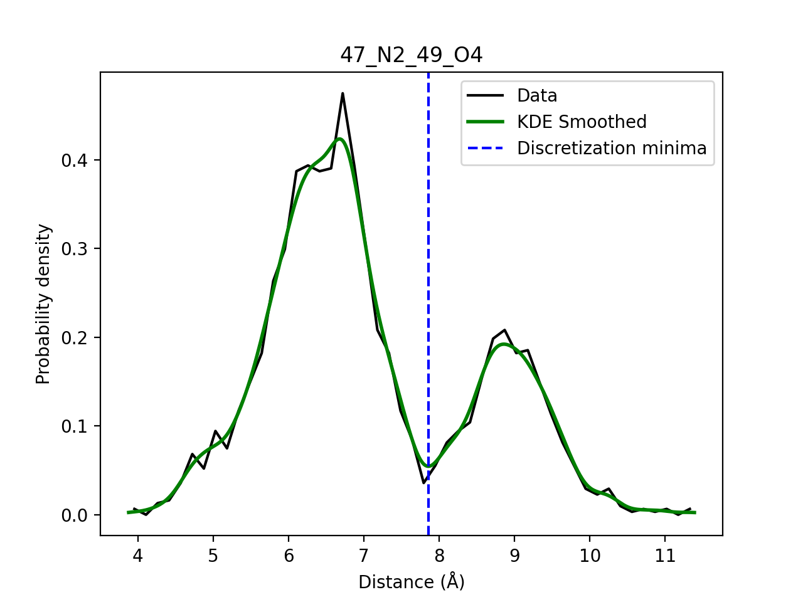
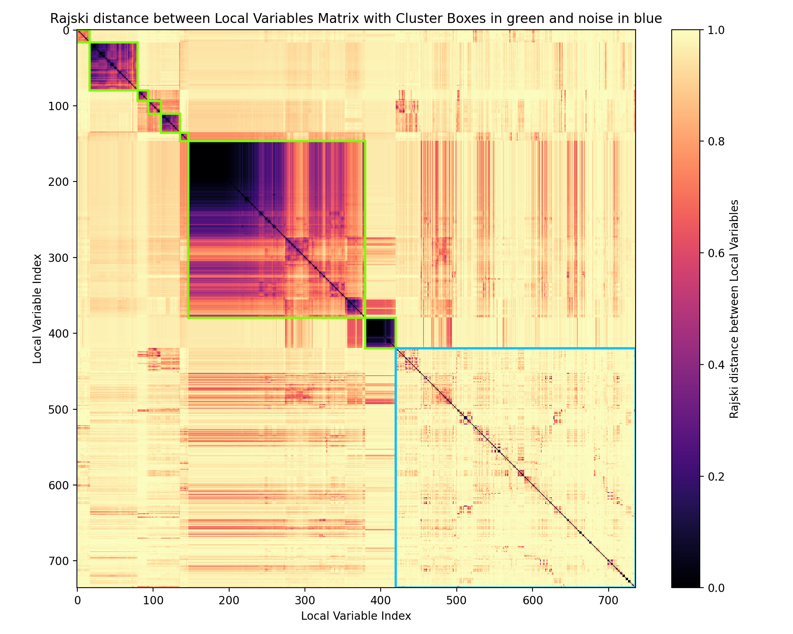
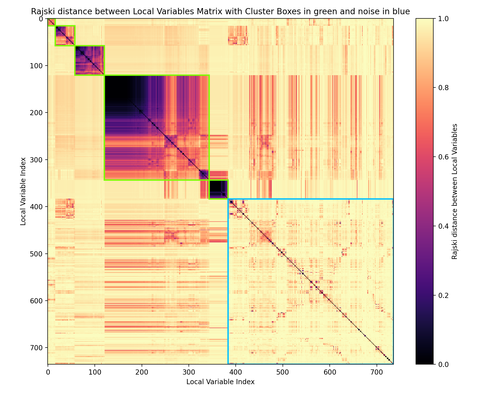
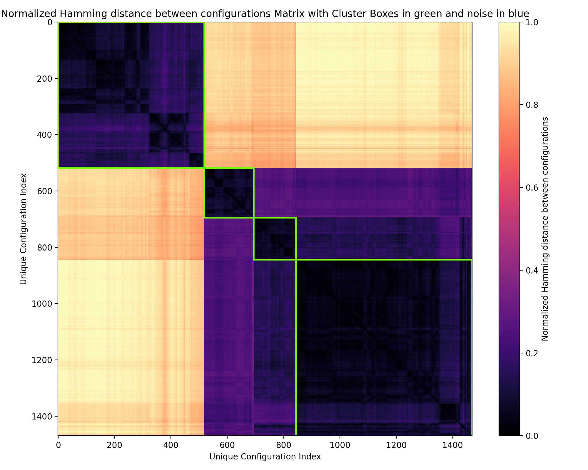
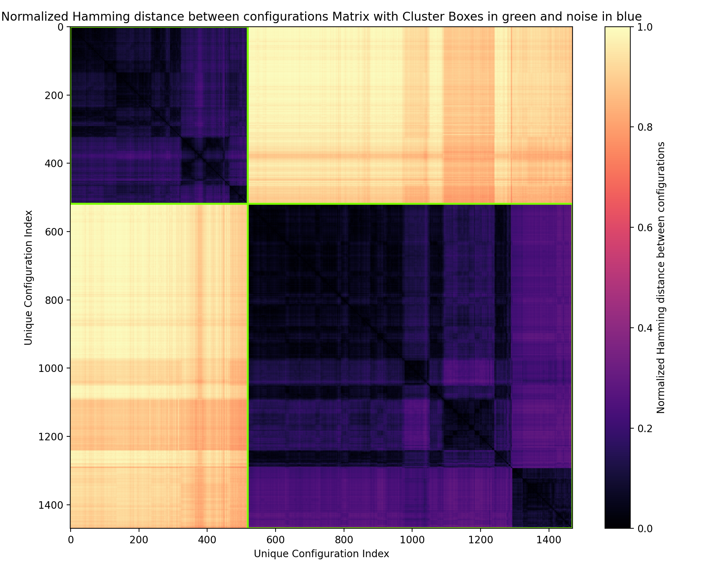

# Tutorial for CASIMODO analysis on the minimal hairpin ribozyme
### This tutorial will guide you through the process of analyzing a molecular dynamics simulation of the minimal hairpin ribozyme using CASIMODO. The tutorial lasts for apporximately 10 minutes, is designed to be user-friendly and will help you understand how to set up and run the analysis.


## Presentation of the system
The minimal hairpin ribozyme (HpR) is a small RNA molecule that is able to catalyze its self-cleavage reaction. The simulation anlayzed in this tutorial is a 200 ns REST2 molecular dynamics simulation extracted from the work of S. Forget _et al._ (2024) _doi: https://doi.org/10.1021/acs.jctc.4c00294_. All simulation files from this paper are available on Zenodo (_zenodo.11033971_) and the files used in this tutorial are the ones in the directory `REST2s/cOL3_ezOL1_tip3p_ini_L1-pucker/` of this Zenodo archive:
* `run_aligned_nowater_REST2_L1p_A1c.G8c.A38H_cOL3_ezOL1_300K.gro`: A structure file in GROMACS format containing the topology and coordinates of the system. This file was renamed [input_data/topol_RNA.gro](input_data/topol_RNA.gro) for the purpose of this tutorial.
* `run_aligned_nowater_REST2_L1p_A1c.G8c.A38H_cOL3_ezOL1_300K.xtc`: A trajectory file in GROMACS format containing the coordinates of the system over time. This file was renamed [input_data/traj_RNA.xtc](input_data/traj_RNA.xtc) for the purpose of this tutorial.

This system was chosen for this tutorial because it is a small RNA molecule that exhibits substantial conformational changes over a short simulation. Therefore, CASIMODO should run very fast and produce satisfying results within seconds. For larger systems and longer simulations, the analysis time is expected to be longer.

## 1 - Download the data
Install CASIMODO by following the indications in [../README.md](../README.md).

Download the [input_data/](input_data) directory and place it in your working directory.

Download the dictionary file for the tutorial ([dic_for_tutorial_RNA.txt](dic_for_tutorial_RNA.txt)) and place it in your working directory. This dictionary file was prepared by adding the nucleic acid names specific to the force-field used by Forget _et al._ to the regular CASIMODO dictionary [../dic_important_atoms_protein_nucleic_acids.txt](../dic_important_atoms_protein_nucleic_acids.txt).


Download the subimission file [../submit_CASIMODO.sh](../submit_CASIMODO.sh) and place it in your working directory.

## 2 - Preparation of the submission file
Rename the submission file to [submit_CASIMODO_tutorial_RNA.sh](submit_CASIMODO_tutorial_RNA.sh) and update the following parameters:
* `output_directory`: the output directory for this tutorial will be named [results_CASIMODO_tutorial_RNA/](results_CASIMODO_tutorial_RNA).
* `topol_file`: the topology file for this tutorial is the structure file [input_data/topol_RNA.gro](input_data/topol_RNA.gro).
* `trj_file`: the trajectory file for this tutorial is [input_data/traj_RNA.xtc](input_data/traj_RNA.xtc).
* `dic_file`: the dictionary file for this tutorial is [dic_for_tutorial_RNA.txt](dic_for_tutorial_RNA.txt).
* `time_zero`: the simulation is 200 ns long but we only want to study the last 100 ns, we thus set the time to start the analysis to `100000` ps. 
* `position_CASIMODO`: this should be the location of the directory [CASIMODO_utils/](../CASIMODO_utils) on your machine.

## 3 - Initial run
Run the initial CASIMODO analysis by executing the submission script with the following command:
```bash
bash submit_CASIMODO_tutorial_RNA.sh
``` 

Do not forget to load the appropriate modules and environments before running.

To check the progress of the analysis, the [results_CASIMODO_tutorial_RNA/casimodo.log](results_CASIMODO_tutorial_RNA/casimodo.log) file can be monitored.

The results are stored in the directory [results_CASIMODO_tutorial_RNA/](results_CASIMODO_tutorial_RNA).

## 4 - Inspecting discretization of local variables
Verify that the discretization of local variables is correct.

To do so, first visually inspect some of the discretized distribution plots in [results_CASIMODO_tutorial_RNA/local_variables_plots/](results_CASIMODO_tutorial_RNA/local_variables_plots/). The name of a distance between atom 1 of nucleic acid 1 and atom 2 of nucleic acid 2 is constructed as follows: `#Nucleic Acid 1` _ `Name Atom 1` _ `#Nucleic Acid 2` _ `Name Atom 2`. 

For example, the distance between atom N2 of nucleic acid 47 and atom O4 of nucleic acid 49 has the following discretized distribution:


Considering that the analyzed part of the trajectory contains only 2000 frames, the distribution look good enough, and the discretization is also satisfying.

All the discretized local variables are listed in [results_CASIMODO_tutorial_RNA/selected_local_variables.txt](results_CASIMODO_tutorial_RNA/selected_local_variables.txt).

For the previous distance, the corresponding line in this file is `47_N2_49_O4 0 7.855 1`, which can be read as follows: the distance between atom N2 of nucleic acid 47 and atom O4 of nucleic acid 49 is associated with label 0 before 7.855 Å and with label 1 after.

The number of lines in [results_CASIMODO_tutorial_RNA/selected_local_variables.txt](results_CASIMODO_tutorial_RNA/selected_local_variables.txt) tells you how many local variables are discretized by CASIMODO.

## 5 - Clustering of local variables 
Once the local variables are discretized, CASIMODO cluster them in communities of local variables that are correlated. To do so, the distance matrix [results_CASIMODO_tutorial_RNA/information_plots/rajski_distance.png](results_CASIMODO_tutorial_RNA/information_plots/rajski_distance.png) is computed and clustered to obtain the following clustered matrix:

 

8 communities of local variables are identified as green clusters and the variables assigned to noise are in the blue cluster. The clustering alreaddy looks good but we would like to have larger and purer clusters. 

To do so, go to your submission file and update the following parameter:
* `parameters_clustering_local_variables`: (10 10 0.5) -> (15 15 0.5)

The clustering parameters are described in [../README.md](../README.md). Here we changed `min_cluster_size` from 10 to 15 to have bigger clusters and we changed `min_samples` from 10 to 15 to have purer clusters.

To only rerun the clustering of local variables, change the `step_to_perform` parameter to `cluster_local_variables`.

Rerun CASIMODO:
```bash
bash submit_CASIMODO_tutorial_RNA.sh
``` 

You should obtain the following map in which the communities are large and very pure:
 

Clustering of the local variables is a step that should be performed iteratively until you are satisfied with the results. The level of clustering you choose depends on the level of coarse-graining of the protein motions you are interested in. If you are not sure, the default parameters are usually already good parameters. Ultimately, the exact composition of the communities can vary a little without affecting the next step, so we advise not to spend too much time optimizing the clustering parameters but instead stopping when the first satisfying result is obtained.

The composition of each community of local variables is detailed in [results_CASIMODO_tutorial_RNA/communities_of_local_variables.txt](results_CASIMODO_tutorial_RNA/communities_of_local_variables.txt). This is alreaddy an important output as it tells you what local variables are correlated together along the MD simulation.

If you want to represent the communities onto a 3D structure, you can use the file [results_CASIMODO_tutorial_RNA/resids_in_communities_of_LVs.txt](results_CASIMODO_tutorial_RNA/resids_in_communities_of_LVs.txt) in which the residues involved in the variables of each community are listed.

## 6 - Obtaining collective conformational states
After you are satisfied by the clustering of local variables, you should rerun the clustering of configurations into conformational states. 

To do so, change in your submission file the `step_to_perform` parameter to `get_conformations`.

Rerun CASIMODO:
```bash
bash submit_CASIMODO_tutorial_RNA.sh
``` 

Check the clustering of configurations performed for each community of LVs.

For example, for community 3, look at the map [results_CASIMODO_tutorial_RNA/conformational_states_clustering/distances_between_configurations_community_3.png](results_CASIMODO_tutorial_RNA/conformational_states_clustering/distances_between_configurations_community_3.png):



The clustering of configurations is alreaddy good but it looks like we can simplify it to only 2 clusters. To rerun clustering of configurations only for community 3, change the following parameters in the submission file: 
* `method_clustering_conformations`: `ward` -> `k-means` because we want exactly 2 clusters.
* `parameters_clustering_conformations`: `2.0` -> `2` the number of clusters we want in k-means (in this case we could have keep a float but it is cleaner to use an integer instead).
* `community_to_process`: `-1` -> `3` instead of processing all the communities we only want to process community 3.

Rerun CASIMODO:
```bash
bash submit_CASIMODO_tutorial_RNA.sh
``` 

After rerunning CASIMODO with new clustering parameters for community 3, we obtain this new map:


Now we indeed only have 2 conformations for community 3. To obtain more details about what are the 2 conformations, look at the [results_CASIMODO_tutorial_RNA/conformational_states_clustering/conformations_community_3.txt](results_CASIMODO_tutorial_RNA/conformational_states_clustering/conformations_community_3.txt) file. In this file, the probability of each conformation is given, as well as a detailed description of the most probable single configuration in each conformation (a conformation being a group of similar single configurations). The list of the frames in each conformation is given in [results_CASIMODO_tutorial_RNA/conformational_states_clustering/frames_conformations_from_community_3.ndx](results_CASIMODO_tutorial_RNA/conformational_states_clustering/frames_conformations_from_community_3.ndx).

If you want to split the trajectory by conformation, you should change the `split_trajectory` parameter to 1 when running clustering of the configurations in conformations.

Obtaining the conformations associated with each of the communities is the main objective of CASIMODO. Don't hesitate to spend time understanding what these conformational changes correspond to in your system. The details contained in [results_CASIMODO_tutorial_RNA/conformational_states_clustering/conformations_community_3.txt](results_CASIMODO_tutorial_RNA/conformational_states_clustering/conformations_community_3.txt) are a precious source of molecular understanding for this purpose.

You should do the same procedure as what we did for community 3 for each of the communities of local variables. Here again, there is no single set of good clustering parameters, and it all depends on the level of coarse-graining of the conformational space you want to achieve. If you are not sure, the default parameters are usually a good starting point.

## 7 - Compare communities
To compare the conformational changes occurring in the different communities and check whether they are independent, change the `step_to_perform` parameter to `compare_communities` in your submission file and rerun CASIMODO:
```bash
bash submit_CASIMODO_tutorial_RNA.sh
``` 

The different outputs are saved in [`conformations_clustering/plots_compare_communities/`](results_CASIMODO_tutorial_RNA/conformational_states_clustering/plots_compare_communities) and are described below:
* [conformational_states_as_function_of_time.png](results_CASIMODO_tutorial_RNA/conformational_states_clustering/plots_compare_communities/conformational_states_as_function_of_time.png) shows the time evolutions of the different conformational trajectories associated with the different communities. It is useful to identify transitions in time ordered trajectory (not like the one used in this tutorial) and to visually compare the conformational trajectories between communities.
* [correlation_conformations_between_communities.png](results_CASIMODO_tutorial_RNA/conformational_states_clustering/plots_compare_communities/correlation_conformations_between_communities.png) show the Pearson correlation coefficients between the different conformational trajectories. 
* [cramers_v_between_communities.png](results_CASIMODO_tutorial_RNA/conformational_states_clustering/plots_compare_communities/cramers_v_between_communities.png) shows the Cramér's V between the different conformational trajectories. 
* [ARI_between_communities.png](results_CASIMODO_tutorial_RNA/conformational_states_clustering/plots_compare_communities/ARI_between_communities.png) shows the Adjusted Rand Index between the different conformational trajectories. 